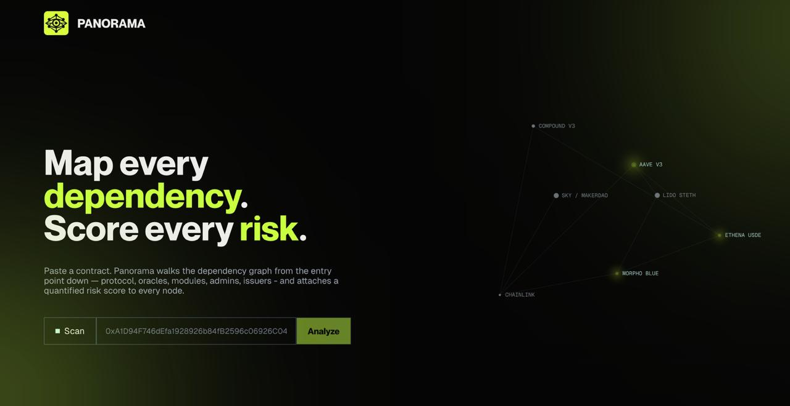

<p align="center">
  
</p>

<h1 align="center">Panorama</h1>

<p align="center">
  <strong>Map every dependency.</strong>
</p>

<p align="center">
Panorama is a smart contract dependency analyzer that visualizes the entire dependency graph of Ethereum contracts.
</p>



## 🎯 What is Panorama?

Panorama walks the dependency graph from any smart contract entry point down through protocols, oracles, modules, admins, and token issuers. It helps developers and security researchers understand the complete structure of their smart contracts.

## ✨ Features

- 🔗 **Dependency Graph Visualization** - Interactive hierarchical graph showing all contract dependencies
- 🎨 **Type-Based Visualization** - Visual indicators for different contract types
- 🌳 **Dependency Tree View** - Hierarchical tree structure showing parent-child relationships
- 🔍 **Detailed Metadata** - Contract tier, source availability
- 🎯 **Interactive Nodes** - Click any node to view detailed information
- 🖱️ **Draggable Graph** - Move nodes around to customize your view
- 🤖 **AI Protocol Summaries** - Automatic protocol analysis when no node is selected


## 🏗️ Architecture

### Frontend
- **Next.js 16** - React framework with App Router
- **React 19** - Latest React with concurrent features
- **TailwindCSS 4** - Utility-first CSS framework
- **TanStack Query** - Powerful data fetching and caching
- **TypeScript** - Type-safe development

### Backend
- **Express** - Fast, minimalist web framework
- **TypeScript** - Type-safe backend development
- **Viem** - Lightweight Ethereum library
- **Etherscan API** - Contract verification and source code
- **Sourcify API** - Decentralized contract verification

### Infrastructure
- **Docker** - Containerized deployment
- **Docker Compose** - Multi-container orchestration
- **Monorepo** - Shared types between frontend and backend

## 🚀 Quick Start

### Using Docker (Recommended)

```bash
# Start the entire stack
docker-compose up

# Or use the convenience script
./start.sh
```

**Access:**
- Frontend: http://localhost:3000
- Backend: http://localhost:5000

### Manual Setup

**Backend:**
```bash
cd backend
npm install
npm run dev
```

**Frontend:**
```bash
cd frontend
npm install
npm run dev
```

## 📖 Usage

1. **Enter a Contract Address** - Paste any Ethereum contract address into the input field
2. **Analyze** - Click "Analyze" or press Enter to start the analysis
3. **Explore the Graph** - View the interactive dependency graph
4. **Inspect Nodes** - Click on any node to see detailed information
5. **Navigate** - Use zoom controls and drag nodes to customize your view


## 🛠️ Development

### Project Structure

```
panorama/
├── frontend/           # Next.js frontend application
│   ├── app/           # App router pages
│   ├── lib/           # Utilities, hooks, API clients
│   └── public/        # Static assets
├── backend/           # Express backend API
│   └── src/
│       ├── clients/   # External API clients
│       ├── services/  # Business logic
│       └── routes/    # API routes
├── packages/
│   └── shared/        # Shared TypeScript types
└── docs/              # Documentation and screenshots
```

### Available Commands

**Docker:**
```bash
make dev       # Start development environment
make prod      # Start production environment
make logs      # View logs
make down      # Stop containers
make clean     # Remove all containers and volumes
```

**Development:**
```bash
# Backend
cd backend
npm run dev    # Start dev server with hot reload

# Frontend
cd frontend
npm run dev    # Start Next.js dev server
npm run build  # Build for production
npm run start  # Start production server
```

## 🔧 Configuration

### Environment Variables

**Frontend** (`.env.local`):
```env
NEXT_PUBLIC_API_BASE_URL=http://localhost:5000
```

**Backend** (`.env`):
```env
PORT=5000
ETHERSCAN_API_KEY=your_api_key_here
# Optional: AI-powered protocol summaries (free!)
HUGGINGFACE_API_KEY=your_huggingface_token_here
```

**Get Hugging Face API Key (Free):**
1. Go to [huggingface.co/settings/tokens](https://huggingface.co/settings/tokens)
2. Create a new token (read access is enough)
3. Copy and paste into `.env` file

## 📚 API Documentation

### Endpoints

**POST** `/api/graph/build`
```json
{
  "address": "0x...",
  "chain_id": 1,
  "depth": 3
}
```

**Response:**
```json
{
  "root": "0x...",
  "nodes": [...],
  "edges": [...],
  "summary": "..."
}
```

## 🤝 Contributing

Contributions are welcome! Please feel free to submit a Pull Request.

---

**Built with ❤️ for the Ethereum ecosystem**
