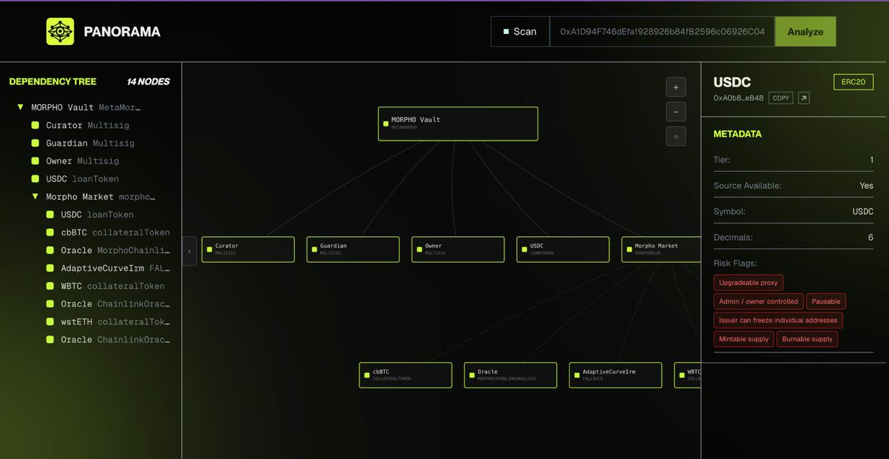
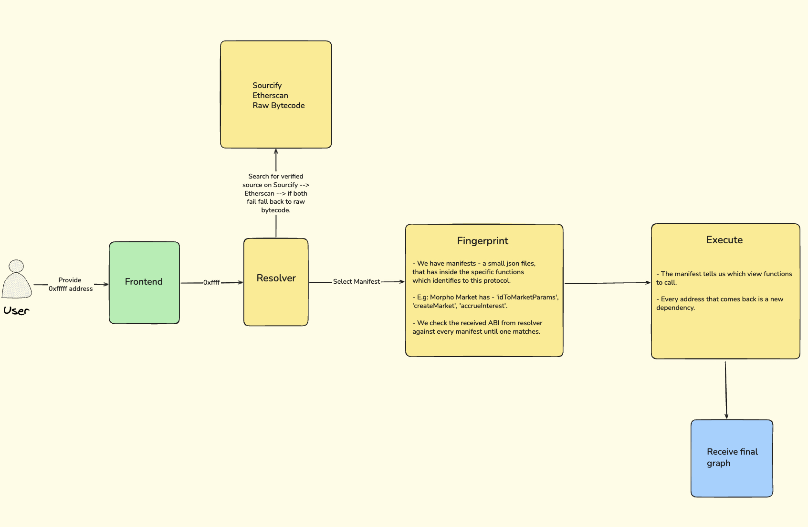

<p align="center">
  
</p>

<h1 align="center">Panorama</h1>

<p align="center">
  <strong>Map every dependency.</strong>
</p>

<p align="center">
Panorama is a smart contract dependency analyzer that visualizes the entire dependency graph of Ethereum contracts.
</p>


## 🎯 What is Panorama?

Panorama is a smart contract dependency analyzer that visualizes the entire dependency graph in a way that you can clearly see what your vault or pool or strategy depends on. Every node in the graph is a standalone smart contract which plays a specific role (e.g.: multisig owner, oracle, lending market, ...) inside your root contract. The nodes have basic information like number of signers, found risk flags (e.g: upgradeable proxy) which will be useful during the research and analysis. 

## ✨ Features 

- 🔗 **Dependency Graph Visualization** - Interactive hierarchical graph showing all contract dependencies
- 🌳 **Dependency Tree View** - Hierarchical tree structure showing parent-child relationships
- 🔍 **Detailed Metadata** - Contract tier, source availability
- 🎯 **Interactive Nodes** - Click any node to view detailed information
- 🖱️ **Draggable Graph** - Move nodes around to customize your view
- 🤖 **AI Protocol Summaries** - Automatic protocol analysis when no node is selected



## 🏗️ Architecture

### Workflow



### Project Structure

```
Panorama/
├── backend/                              # Express + TypeScript API
│   ├── src/
│   │   ├── app.ts                        # Server entry point
│   │   ├── clients/                      # External service clients
│   │   │   ├── etherscan.client.ts
│   │   │   ├── http.ts
│   │   │   ├── rpc.client.ts
│   │   │   └── sourcify.client.ts
│   │   ├── config/
│   │   │   └── config.ts                 # Env vars, depth limits, constants
│   │   ├── controllers/
│   │   │   ├── ai-summary.controller.ts
│   │   │   └── graph.controller.ts
│   │   ├── middleware/
│   │   │   └── error.middleware.ts
│   │   ├── routes/
│   │   │   ├── ai.router.ts
│   │   │   └── graph.router.ts
│   │   └── services/
│   │       ├── ai-summary.service.ts
│   │       ├── cache.service.ts
│   │       ├── graph.service.ts          # BFS dependency-graph builder
│   │       ├── resolver.service.ts
│   │       ├── router.service.ts
│   │       ├── manifests/                # Protocol manifests + executor
│   │       │   ├── executor.ts
│   │       │   ├── index.ts
│   │       │   ├── types.ts
│   │       │   └── protocols/            # erc20, morpho-*, safe-multisig
│   │       └── risk/                     # Risk-flag detection (universal + per-profile)
│   │           ├── index.ts
│   │           ├── universal.ts
│   │           ├── types.ts
│   │           └── profiles/token.ts
│   ├── Dockerfile
│   └── package.json
│
├── frontend/                             # Next.js (App Router) UI
│   ├── app/
│   │   ├── layout.tsx
│   │   ├── page.tsx                      # Landing page
│   │   ├── providers.tsx
│   │   ├── globals.css
│   │   ├── dashboard/[address]/page.tsx  # Dynamic analysis page
│   │   └── src/components/
│   │       ├── dashboard/                # Graph, node info, metadata, tabs
│   │       ├── lending/                  # Landing hero, scan input, header
│   │       └── shared/                   # Background glow, intro
│   ├── lib/
│   │   ├── api/                          # graph + ai-summary HTTP clients
│   │   ├── config/api.config.ts
│   │   ├── context/selected-node.context.tsx
│   │   ├── hooks/                        # useGraphAnalysis, useAiSummary
│   │   ├── utils/node-display.ts
│   │   └── validation/address.validation.ts
│   ├── public/
│   ├── Dockerfile
│   └── package.json
│
├── packages/
│   └── shared/src/                       # Shared types between FE/BE
│       ├── index.ts
│       └── types.ts
│
├── img/
├── docker-compose.yml
├── Makefile
├── start.sh
└── README.md
```

### Frontend
- **Next.js 16** - React framework with App Router
- **React 19** - Latest React with concurrent features
- **TailwindCSS 4** - Utility-first CSS framework
- **TanStack Query** - Powerful data fetching and caching
- **TypeScript** - Type-safe development

### Backend
- **Express** - Fast, minimalist web framework
- **TypeScript** - Type-safe backend development
- **Viem** - Lightweight Ethereum library
- **Etherscan API** - Contract verification and source code
- **Sourcify API** - Decentralized contract verification

### Infrastructure
- **Docker** - Containerized deployment
- **Docker Compose** - Multi-container orchestration
- **Monorepo** - Shared types between frontend and backend

## 🚀 Quick Start

### Environment Variables

**Frontend** (`.env.local`):
```env
NEXT_PUBLIC_API_URL=http://localhost:5000
```

**Backend** (`.env`):
```env
SERVER_PORT=5000
ETHERSCAN_API_KEY=your_api_key_here
# Optional: AI-powered protocol summaries (free!)
HUGGINGFACE_API_KEY=your_huggingface_token_here
```

**Get Hugging Face API Key (Free):**
1. Go to [huggingface.co/settings/tokens](https://huggingface.co/settings/tokens)
2. Create a new token (read access is enough)
3. Copy and paste into `.env` file

### Available Commands

**Docker:**
```bash
make dev       # Start development environment (detached)
make up        # Start containers in foreground
make build     # Rebuild containers
make logs      # View logs
make down      # Stop containers
make restart   # Restart containers
make clean     # Remove all containers and volumes
```

**Development:**
```bash
# Backend
cd backend
npm run dev    # Start dev server

# Frontend
cd frontend
npm run dev    # Start Next.js dev server
```

### Using Docker (Recommended)

```bash
# Start the entire stack
docker compose up

# Or use the convenience script
./start.sh
```

**Access:**
- Frontend: http://localhost:3000
- Backend: http://localhost:5000

### Manual Setup

**Backend:**
```bash
cd backend
npm install
npm run dev
```

**Frontend:**
```bash
cd frontend
npm install
npm run dev
```

## 📖 Usage
**Important Note**. Panorama is a prototype project and currently it is working only on Ethereum Mainnet for Morpho Vault V1.

1. **Enter a Contract Address** - Paste an Ethereum contract address into the input field
2. **Analyze** - Click "Analyze" or press Enter to start the analysis
3. **Explore the Graph** - View the interactive dependency graph
4. **Inspect Nodes** - Click on any node to see detailed information
5. **Navigate** - Use zoom controls and drag nodes to customize your view

## 📚 API Documentation

### Endpoints

**POST** `/api/graph`
```json
{
  "address": "0xfff",
  "chain_id": 1,
  "depth": 3
}
```
- `address` - address of the contract you want to build graph for
- `chain_id` - ID of the chain where the contract lives
- `depth` - controls how many levels deep the BFS traversal expands the dependency graph from the root contract (e.g: depth = 3. This means 3 steps out from the root).

**Response:**
```json
{
  "root": "0x...",
  "nodes": [...],
  "edges": [...],
  "graphRiskScore": 0,
  "summary": null
}
```
- `root` - the root contract address
- `nodes` - node objects describing each dependency found inside the root contract
- `edges` - edge objects describing the relationship between nodes (e.g. `node1 --> node2` means `node2` was found inside `node1`)
- `graphRiskScore` - aggregate risk score (currently always `0` — scoring engine is disabled)
- `summary` - always `null` here; the AI summary is fetched separately via `POST /api/ai/summary`

**POST** `/api/ai/summary`

Body: the full `GraphResponse` object returned by `/api/graph`.

**Response:**
```json
{
  "summary": "..."
}
```
- `summary` - one or two sentences of AI-generated protocol description. Uses Hugging Face Inference if `HUGGINGFACE_API_KEY` is set, otherwise falls back to a deterministic template built from the graph data.

## 🤝 Contributing

Contributions are welcome! Please feel free to submit a Pull Request.

---

**Built with ❤️ for the Ethereum ecosystem**